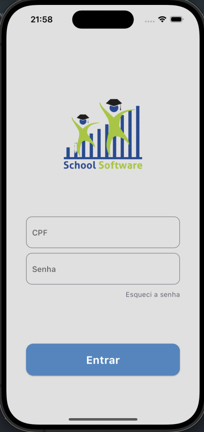
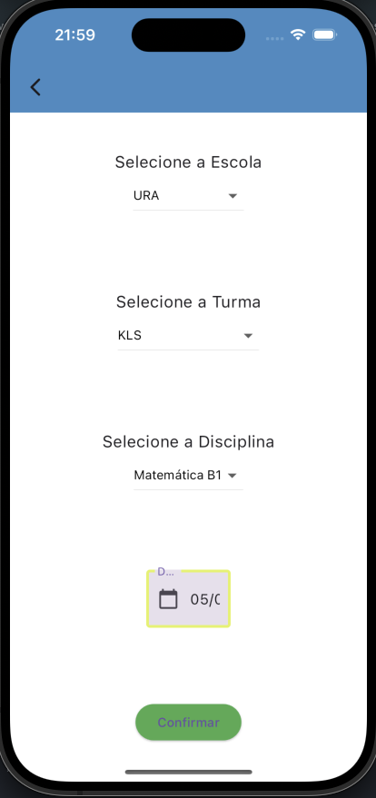

# Aplicativo de chamadas

app school é um aplicativo de chamada de alunos voltado para o uso de professores.

## Objetivo

Este projeto/aplicativo tem como finalidade que o professor faça o login, escolha a escola, escolha sua turma, disciplina e dia, após escolher, aparecerá a lista de alunos e poderá marcar a presença dos mesmos e confimar.

